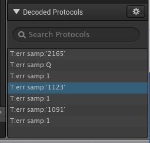
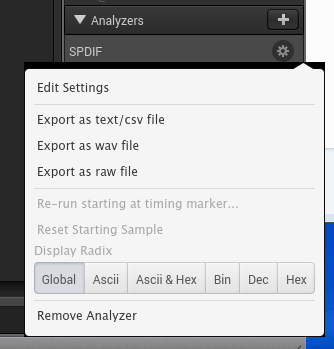

SPDIF Logic Analyzer
====================

This plugin is for use in the [Saleae Logic](http://www.saleae.com/downloads) program to decode captured data from any SPDIF Interface.

LICENSE is GPLv2

So far I've built/run it on 64 bit windows and linux.

Installation
-----
To build the plugin, change to the plugin directory and run `python build_analyzer.py`.

Once built (look for any errors in the build output), open Saleae Logic and Click

Options > Preferences > "Developer" Tab

The only option should be an area to specify a folder. Point this to the `release` folder in this plugin directory. If you already have a generic user-directory to collect plugins, copy `release/libspdifAnalyzer.so` to your folder. Other architectures may use other file extensions (Mac: dylib; Linux: so; Windows: dll).

Features
--------
* Auto-clocking, will track changes in clock speed.
* Marks "B" frame boundaries with a white Dod
* Marks out-of-sequence "B" frames with a red Dot
* Marks non-decodable gaps in SPDIF interface with red X
* WAV Output, save the capture to a wave file (48.0 kHz only)
* RAW Output, save all 32-bit words from the interface
* Errors show in data table

Use
-----
Install and assign to the SPDIF wire.

For reliable capture of 48kHz spdif, capture at 25 MHz
For reliable capture of 192kHz spdif, capture at 100 MHz

As-is
------
This software is provided as-is, with no guarantees, so there.

To-Do
------
* The internal command-line analyzer (spdif.c) detects far more errors than the UI and it would be good to see these capabilities brought out.
* Needs a channel-status and validity bits reported in the data table, ideally only changes would be marked.
* Add a realistic signal generator

